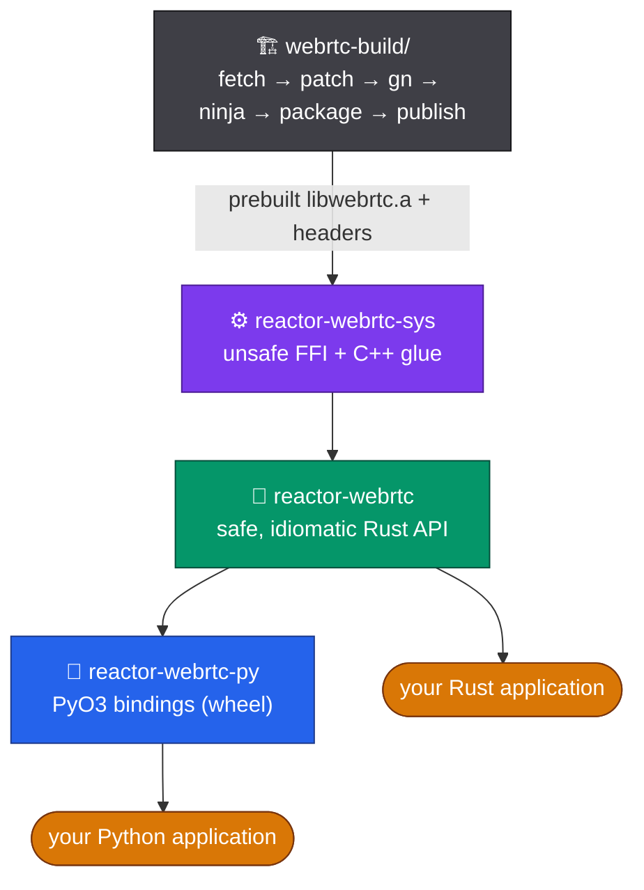
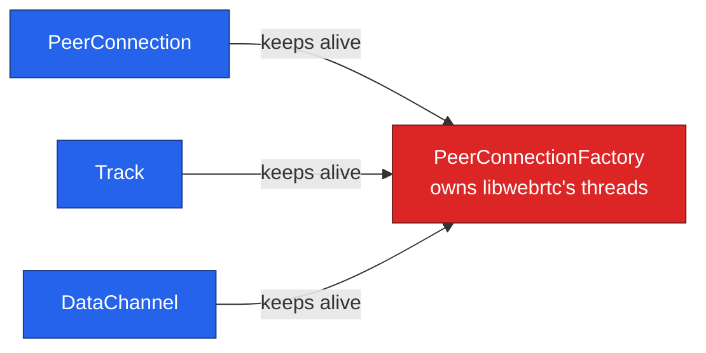
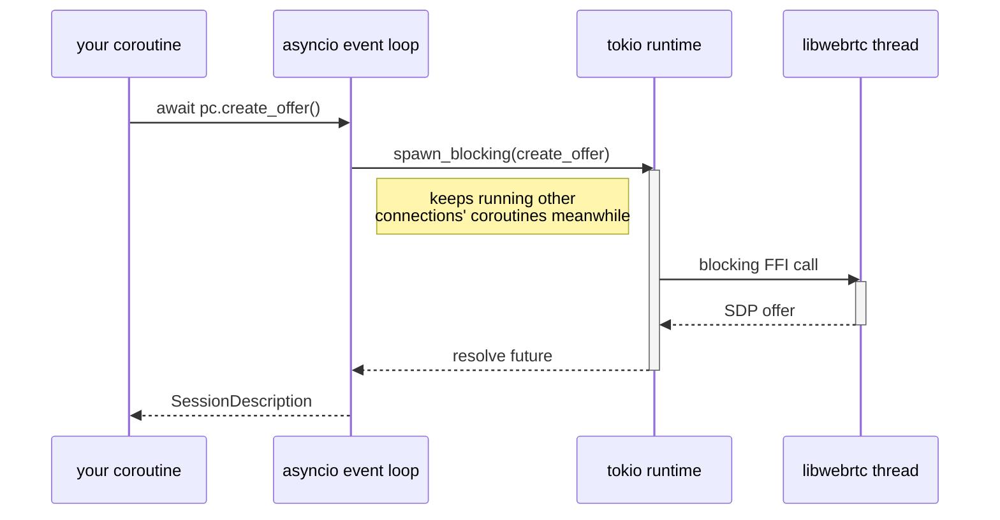

# Architecture

How the pieces fit together, and the constraints that come from wrapping a
single-process native library.

- [Crate layering](#crate-layering)
- [Ownership and lifetime](#ownership-and-lifetime)
- [One factory per process](#one-factory-per-process)
- [Threading model](#threading-model)

## Crate layering

Each layer only depends on the one below it. Application code should depend
on `reactor-webrtc` (Rust) or the `reactor-webrtc` wheel (Python) —
`reactor-webrtc-sys` is public only for someone building a different safe
wrapper or interoperating with another FFI consumer.

## Ownership and lifetime

`PeerConnectionFactory` owns libwebrtc's signaling, worker, and network
threads — real OS threads started on construction and joined on
destruction. The rule that matters for your code: **every object the
factory creates keeps the factory alive until that object is also
dropped, no matter what order you drop things in.**

Concretely: drop the factory while a `PeerConnection`, `Track`, or
`DataChannel` it created is still around, and the factory's threads keep
running until that last object drops too — you never get a dangling
reference to a torn-down factory. This is enforced internally (an `Arc`
around the factory's handle, held by every object it produces); you don't
need to manage it yourself, and it's why a `Track` or `DataChannel` you
detach and keep around independently of its `PeerConnection` is still safe
to use. Before this guarantee existed, dropping the factory first left
other objects holding a pointer into freed thread state — touching one of
them in any way (an SDP offer, a media push, even its own destructor)
segfaulted the process.

## One factory per process

libwebrtc's threads are process-global state: creating a second
`PeerConnectionFactory` before the first has fully destroyed reliably races
those threads and segfaults. **Create one and reuse it** for every
connection your process handles.

The Python binding enforces this for you — a second concurrent
`PeerConnectionFactory()` raises a `RuntimeError` instead of crashing. The
Rust API does **not** enforce this itself; a Rust caller is responsible for
holding to one factory per process (this is exactly why
[`reactor-runtime`](https://github.com/reactor-team/reactor-runtime) keeps a
single process-wide factory behind a lock rather than one per connection).

## Threading model

**Rust core.** Every method is synchronous — a call blocks the calling
thread for the native round-trip. libwebrtc's own signaling/worker/network
threads run independently underneath and are what actually deliver
`PeerConnectionObserver` callbacks (`on_ice_candidate`,
`on_connection_state_change`, `on_track`, …), `Track.on_video_frame` /
`on_audio_frame`, and `FrameTransform` callbacks — on their thread, not the
caller's. A callback that blocks holds up libwebrtc's own internals, not
just your code, so keep them fast and hand off real work to your own thread
or queue.

**Python.** Seven methods — the six signaling methods (`create_offer`,
`create_answer`, `set_local_description`, `set_remote_description`,
`add_ice_candidate`, `get_stats`) plus `set_bitrate` — are natively awaitable:
a small tokio runtime bridges the blocking libwebrtc call through
`spawn_blocking`, so `await`ing one never blocks the asyncio event loop other
connections' coroutines run on:

This diagram shows today's *internal* mechanism — useful for understanding
why `await` doesn't block, but not a contract: the public guarantee is
simply that these seven methods are awaitable and never block the loop,
regardless of how the binding implements that underneath.

Every other method (`add_track`, `transceivers`, `create_data_channel`, and
everything on `Track`/`Transceiver`/`DataChannel`) is a fast synchronous
call with no native round-trip — call it directly, no `await`, no
`asyncio.to_thread`.

Callbacks still fire on libwebrtc's internal threads, with the GIL held —
keep them fast, and if you need to touch asyncio state (schedule a
coroutine, set an `asyncio.Event`), marshal onto the loop explicitly, e.g.
`loop.call_soon_threadsafe(...)`, rather than assuming you're already on it.

## Further reading

- [`configuration.md`](configuration.md) — every `RtcConfiguration` field and
  `set_bitrate`.
- [`frame-metadata.md`](frame-metadata.md) — per-frame metadata and
  encoded-frame transforms.
- [`webrtc-build/README.md`](../webrtc-build/README.md) — how the native
  `libwebrtc` prebuilt is built, packaged, and published.
- [`webrtc-build/patches/README.md`](../webrtc-build/patches/README.md) —
  the patch series applied on top of upstream WebRTC, and why.
